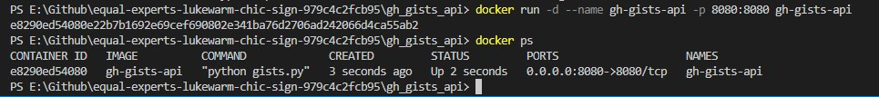

# GitHub Gists API

An API application using GitHub API to retrieve public available gists for mentioned user.

## Pre-Requisites
---

Below setups be installed in the system

- [Docker](https://www.docker.com/)
- [Python 3.11+](https://www.python.org/downloads/release/python-3114/)  (If running on local system)

## Steps
---

- Clone repository:

   ```bash
   git clone https://github.com/EqualExperts-Assignments/equal-experts-lukewarm-chic-sign-979c4c2fcb95.git
   ```

-  Navigate to project source directory:

   ```bash
   cd gh_gists_api
   ```

-  Build Docker image. ```.dockerignore``` is placed to ignore files not required during image build.

   ```bash
   docker build -t gh-gists-api .
   ```

   

   


- Create running instance i.e. container from the image created in above step
   ```bash
   docker run -d --name gh-gists-api -p 8080:8080 gh-gists-api
   ```

   

- Check logs in separate terminal with below command

  ```bash
  docker logs -f gh-gists-api
  ```

   

- As an optional step, open interactive session with running container i.e. ```gh-gists-api``` and check contents.

   

## HTTP Usage
---

Post container is up and running, make HTTP requests via browser to retrieve public available github gists for respective user. 

Available Endpoints

- **/gists** : Missing username message and information on providing username

```bash
curl http://localhost:8080/gists
```


- **/gists/{username}** : Replace ```{username}``` with corresponding user id e.g. ***octocat*** to search public gists. 

```bash
curl http://localhost:8080/gists/octocat
```


- **/** : Welcome message . Default Page

```bash
curl http://localhost:8080/
```


## Python Testing
---

As mentioned in pre-requsistes, python 3.10+ needs to be installed within system to run automated testing. Execute below sequence of commands for the same

- Install pip module ```pytest```

   ```bash
   python -m pip install -U pytest
   
2. Navigate to gists_api/tests directory:

   ```bash
   cd gh_gists_api/tests
   
3. Run test:

   ```bash
   python -m pytest -vv
   ```

   
